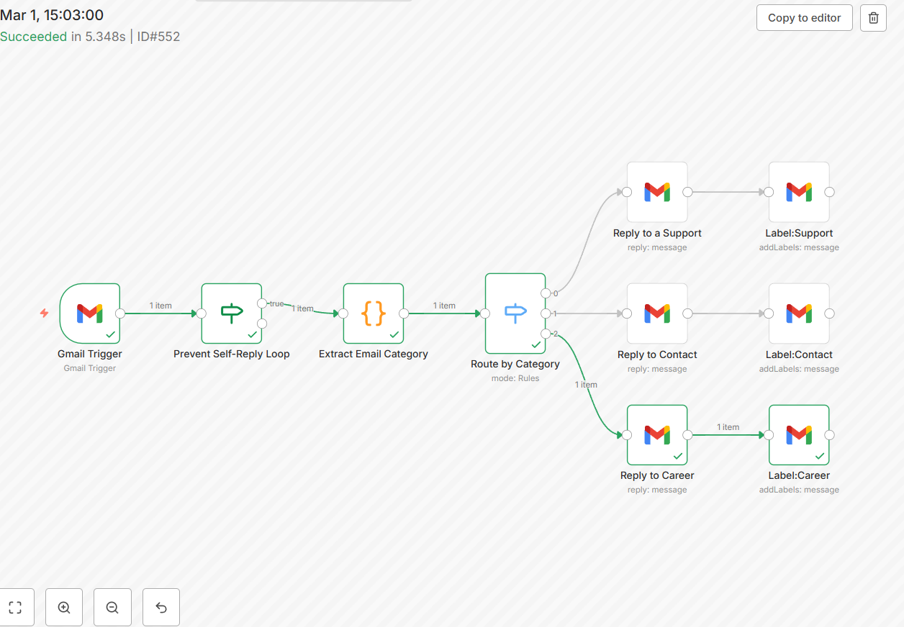

 SMART GMAIL AUTO-RESPONDER USING N8N
🚀Automated Gmail response system built with n8n that classifies incoming emails and send smart replies automatically. 

📌 Project Overview

This project is a production-ready Gmail automation system built using n8n that automatically processes incoming emails and sends intelligent responses.

It reads new emails, identifies their purpose (Support, Contact, Career, etc.), sends the correct reply, and applies Gmail labels for better inbox organization — all in real time.

This workflow reduces manual effort, improves response time, and ensures a structured email management system.

---

✨ Key Features

- 📩 Automatically triggers on new Gmail messages
- 🧠 Classifies emails using conditional logic
- 💬 Sends predefined smart auto-replies
- 🏷️ Applies Gmail labels for organization
- ⚡ Real-time processing
- 🔄 Fully automated workflow
- 📦 Production-ready design

---

🧠 Workflow Logic

Step-by-step Flow:

1. Gmail Trigger → Detects new incoming email
2. IF Node → Checks conditions (email type)
3. Switch Node → Classifies the email
4. Gmail Reply Node → Sends automated response
5. Gmail Label Node → Applies category label

---

🛠️ Tech Stack

- n8n – Workflow automation
- Gmail API – Email integration
- IF & Switch Nodes – Conditional logic
- JSON Workflow – Importable automation setup

---

📂 Project Structure

Smart-Gmail-Auto-Responder
│── README.md
│── Automated Email Classification & Response System.json

---

⚙️ Setup & Usage

1️⃣ Import the Workflow into n8n

- Download the JSON file from this repository
- Open n8n
- Click Import Workflow
- Upload the JSON file

2️⃣ Connect Your Gmail Account

- Add Gmail credentials inside n8n
- Authorize access

3️⃣ Activate the Workflow

- Toggle the workflow to Active

🎉 Your Gmail automation system is now live.

---

🎯 Use Cases

- 📬 Customer support automation
- 🏢 Business email management
- 👨‍💼 Career / HR auto-responses
- 📩 Contact form reply automation
- ⏱️ Reducing manual email handling time

---

📸 Automation Workflow

---

🚀 Future Enhancements

- 🤖 AI-based email classification
- 🌍 Multi-language auto-responses
- 📎 Attachment handling system
- ⭐ Priority-based smart replies
- 📊 Email analytics dashboard

---

💡 Project Highlights

✔ Real-time email automation
✔ Clean and scalable workflow design
✔ Practical business use case
✔ Resume-ready flagship project

---

👩‍💻 Author

Elluru Nandini
CSE Student | Passionate about Automation & AI

---

🌟 Support

If you found this project useful:

⭐ Star this repository
🍴 Fork it
📢 Share it

---

📬 Contact

Feel free to connect for collaboration and opportunities.
